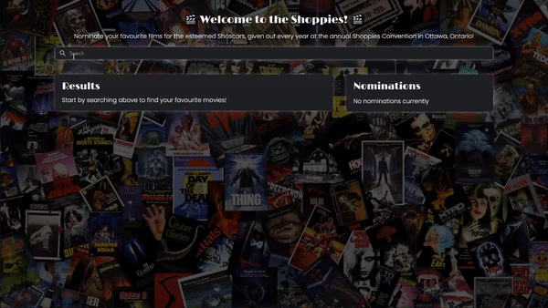

# Shopify-Frontend-Developer-Challenge
This project was created for Shopify's Frontend Developer Challenge, The Shoppies! This project allows you to search for any movie on the OMDB API (https://www.omdbapi.com/) in order to nominate them (up to 5). Hope you Enjoy!

## Link to Project
https://the-shoppies-595bc.web.app/ (Link to full web application)

https://shoppiesserver.herokuapp.com (Server side view of GraphiQL)

## Extras
### Autocomplete
Ever forget the name of a movie you want to find? Never fear! Autocomplete is here! Never forget the name of the movie you want to nominate again!

### Movie Information
Each movie has extra information about the movie when clicked, allowing you to make a more informed decision before nomination!

### Save Nominations
Ever accidentally leave a page to go get snacks and lose all your progress? Not on this site! Your results are automatically saved for whenever you want to return to nominating your favourite picks!

### Animations
To allow for a better user experience, the website has many clean animations for deleting/adding a nomination, loading movies, and buffering when querying for your movie selection!

## Tech Stack
### Server Side
* **[Express](https://expressjs.com/)**
* **[GraphQL](https://graphql.org/)**
* **[Axios](https://www.npmjs.com/package/axios)**
* **[TypeScript](https://www.typescriptlang.org/)**
* **[Eslint](https://eslint.org/)**

### Client Side
* **[React](https://reactjs.org/)**
* **[Redux](https://redux.js.org/)**
* **[Apollo](https://www.apollographql.com/)**
* **[Shopify Polaris](https://www.apollographql.com/)**
* **[TypeScript](https://www.typescriptlang.org/)**
* **[Eslint](https://eslint.org/)**

### Hosting
* **[Heroku](https://www.heroku.com/pricing)** (Server Side)
* **[Firebase](https://firebase.google.com/)** (Client Side)
